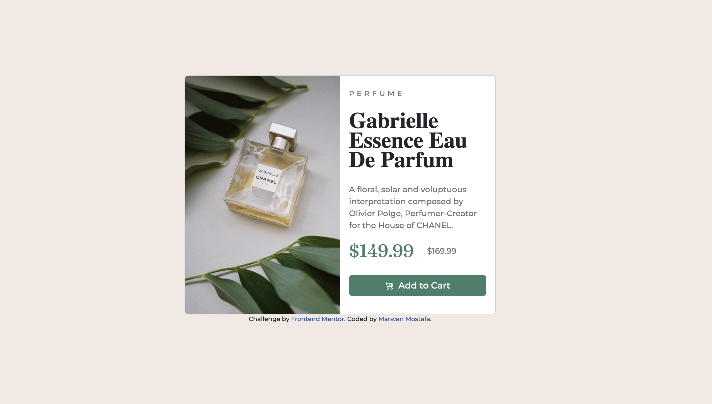

# Frontend Mentor - Product preview card component solution

This is a solution to the [Product preview card component challenge on Frontend Mentor](https://www.frontendmentor.io/challenges/product-preview-card-component-GO7UmttRfa). Frontend Mentor challenges help you improve your coding skills by building realistic projects.

## Table of contents

- [Overview](#overview)
  - [The challenge](#the-challenge)
  - [Screenshot](#screenshot)
  - [Links](#links)
- [My process](#my-process)
  - [Built with](#built-with)
  - [What I learned](#what-i-learned)
  - [Continued development](#continued-development)
  - [Useful resources](#useful-resources)
- [Author](#author)

## Overview

### The challenge

Users should be able to:

- View the optimal layout depending on their device's screen size
- See hover and focus states for interactive elements

### Screenshot

### Links

- Solution URL: [GitHub](https://github.com/MarwanMDev/product-preview-card-component)
- Live Site URL: [GitHub Pages](https://marwanmdev.github.io/product-preview-card-component/)

## My process

### Built with

- Semantic HTML5 markup
- CSS custom properties
- Bootstrap 5
- Bootstrap Icons

### What I learned

Designing across different devices

### Continued development

Front-End development.

### Useful resources

- [Bootstrap 5](https://getbootstrap.com/docs/5.2/getting-started/introduction/) - This helped me in designing and styling components. I really liked this pattern and will use it going forward.
- [Bootstrap Icons](https://getbootstrap.com/docs/5.2/getting-started/introduction/) - This helped me in creating icons.

## Author

- Website - [Marwan Mostafa](https://github.com/MarwanMDev)
- Frontend Mentor - [@yourusername](https://www.frontendmentor.io/profile/MarwanMDev)
